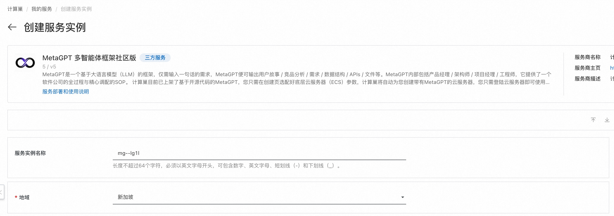
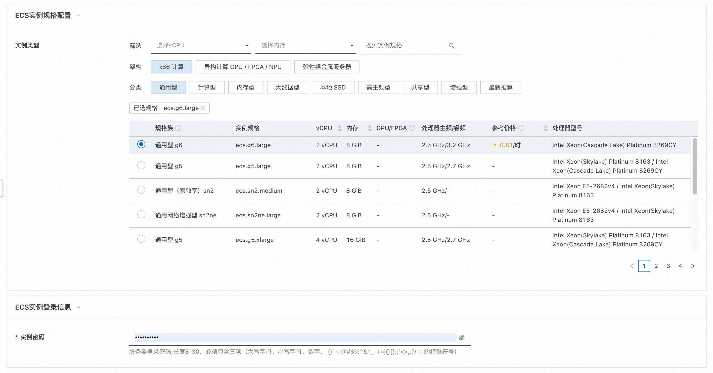
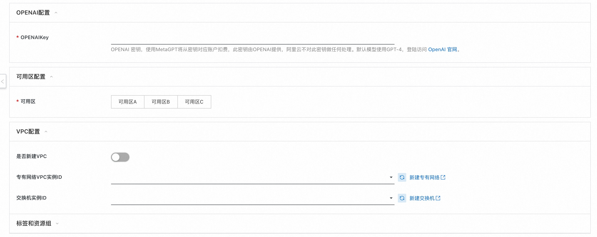
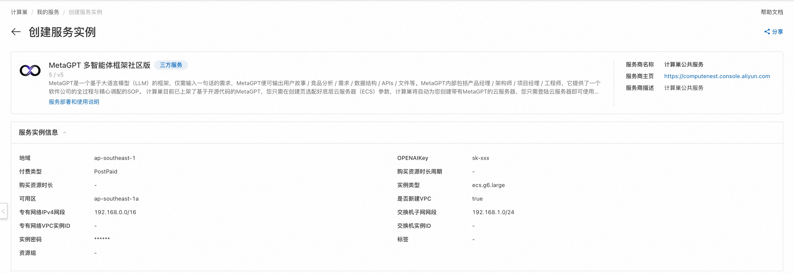
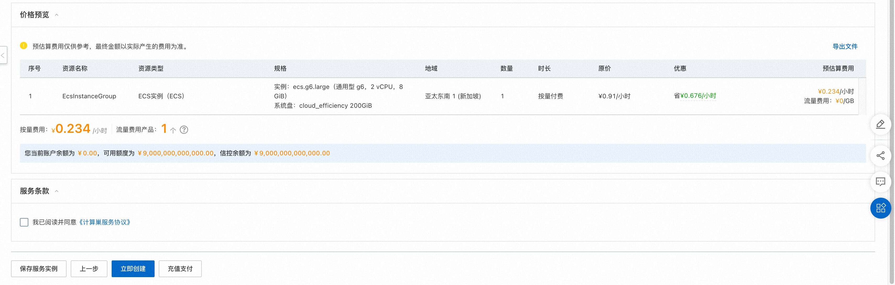
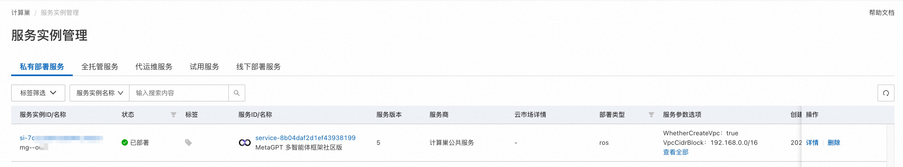
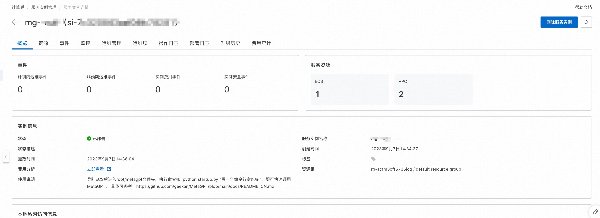
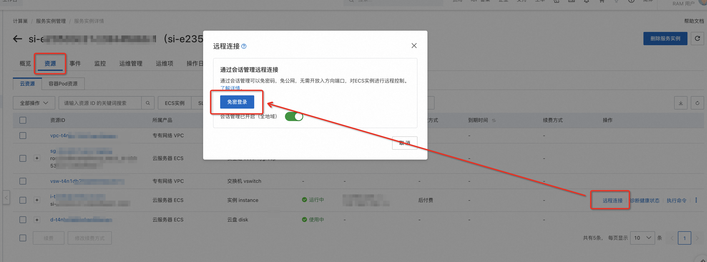
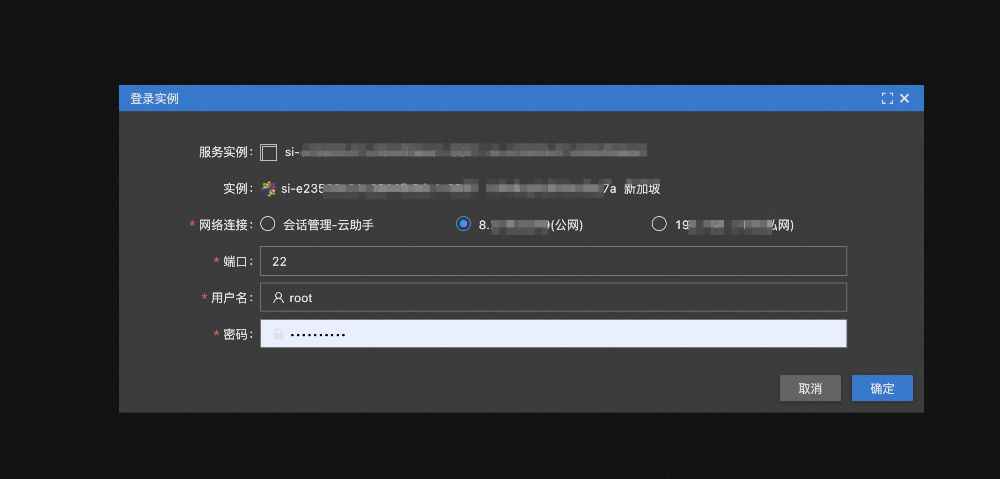
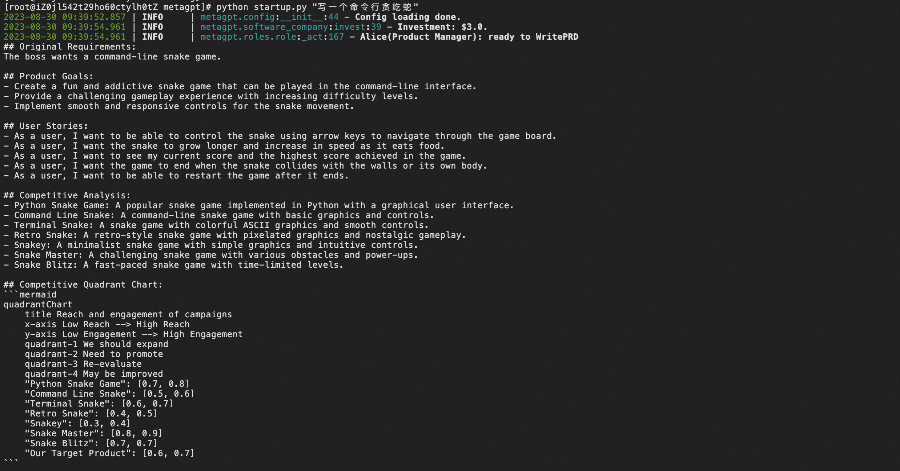

# MetaGPT服务实例部署文档

## 概述
MetaGPT是一个基于大语言模型（LLM）的框架，仅需输入一句话的需求，MetaGPT便可输出用户故事 / 竞品分析 / 需求 / 数据结构 / APIs / 文件等。MetaGPT内部包括产品经理 / 架构师 / 项目经理 / 工程师，它提供了一个软件公司的全过程与精心调配的SOP。
计算巢目前已上架了基于开源代码的MetaGPT，您只需在创建页选配好云服务器（ECS）参数，计算巢将自动为您创建带有MetaGPT的云服务器。创建完成后，您只需登陆ECS即可使用MetaGPT。本文向您介绍如何开通计算巢上的MetaGPT服务以及部署流程和使用说明。使用期间若发现任何问题，欢迎反馈交流。

## 说明

- MetaGPT部署的为社区开源版本，源码参考[Github Repo](https://github.com/geekan/MetaGPT)。
- 本服务需要依赖OpenAI GPT-4 API，请提前准备您的OpenAI Key。

## 部署流程

### 0. 准备工作

在正式开始使用前，您需要一个阿里云账号，对ECS、VPC等资源进行访问和创建操作。

- 若您使用个人账号，可以直接创建服务实例
- 若您使用RAM用户创建服务实例，且是第一次使用阿里云计算巢
    - 需要在创建服务实例前，对使用的RAM用户的账号添加相应资源的权限。添加RAM权限的详细操作，请参见[为RAM用户授
      权](https://help.aliyun.com/document_detail/121945.html)。所需权限如下表所示。
    - 且需要授权创建关联角色，参考下图，选中 **同意授权并创建关联角色**

| 权限策略名称                    | 备注                                    |
|---------------------------------|---------------------------------------|
| AliyunECSFullAccess             | 管理云服务器服务（ECS）的权限             |
| AliyunVPCFullAccess             | 管理专有网络（VPC）的权限                 |
| AliyunROSFullAccess             | 管理资源编排服务（ROS）的权限             |
| AliyunComputeNestUserFullAccess | 管理计算巢服务（ComputeNest）的用户侧权限 |
| AliyunCloudMonitorFullAccess    | 管理云监控（CloudMonitor）的权限          |

其次，由于MetaGPT底层调用了OPENAI的大模型GPT-4，因此还需要您提前注册OPENAI的账号，此账号具有调用GPT-4的权限。

### 1. 部署入口

您可以在阿里云计算巢自行搜索“MetaGPT 多智能体框架社区版”，也可以通过下述部署链接快速到达。

[部署链接](https://computenest.console.aliyun.com/user/cn-hangzhou/serviceInstanceCreate?ServiceId=service-8b04daf2d1ef43938199)

### 2. 创建MetaGPT服务实例

#### 2.1 参数列表

您在创建服务实例的过程中，需要配置服务实例信息的参数列表，具体如下。

| 参数组        | 参数项         | 示例           | 说明                                                                                                          |
|------------|-------------|--------------|-------------------------------------------------------------------------------------------------------------|
| 服务实例名称     | N/A         | test         | 实例的名称                                                                                                       |
| 地域         | N/A         | 华东1（杭州）      | 选中服务实例的地域，建议就近选中，以获取更好的网络延时。                                                                                |
| 付费类型配置     | 付费类型        | 按量付费         | 按实际情况选择付费类型                                                                                                 |
| ECS实例配置    | 实例类型        | ecs.g6.large | 按实际情况选择实例规格                                                                                                 |
| ECS实例登录信息  | 实例密码        | ********     | 设置实例密码。长度8~30个字符，必须包含三项（大写字母、小写字母、数字、 ()`~!@#$%^&*_-+={}[]:;'<>,.?/                                         |
| OPENAI配置   | OPENAIKey   | sk-xxx       | OPENAI 密钥，使用MetaGPT将从密钥对应账户扣费，此密钥由OPENAI提供，阿里云不对此密钥做任何处理。默认模型使用GPT-4，登陆访问 [OpenAI 官网](https://openai.com/)。 |
| 可用区配置      | 可用区         | 可用区I         | 地域下的不同可用区域，确保实例非空                              |
| VPC设置      | 是否新建VPC     | 是            | 若是，计算巢将自动创建VPC和Vswitch，若否，则需要填入已经创建好的VPC和Vswitch                              |
| VPC设置 | 专有网络VPC实例ID | vpc-xxx      | 按实际情况，选择专有网络的ID。                                                                                            |
| VPC设置 | 交换机实例ID     | vsw-xxx      | 按实际情况，选择交换机ID。若找不到交换机, 可尝试切换地域和可用区。                                                                         |

#### 2.2 具体步骤

创建服务按如下步骤进行，参考下图：

- 创建实例名称，非必填
- 选择地域，如下图中“新加坡”

- 选择实例类型: 默认选择ecs.g6.large
- 配置实例的密码

- OPENAIKey：输入OPENAI账号所对应的OPENAIKey，格式为“sk-……”。计算巢仅将此OPENAIKey传入MetaGPT作为调用API凭证，不会执行如记录、校验、鉴权等任何操作。为保证后续正常使用，请保证此Key所对应账号具有访问权限且余额充足。
- 选择部署区域，如下图中“可用区A”
- VPC设置：可选新建或填入已有VPC/Vswitch

- 点击下一步，进入订单确认页面
- 勾选“我已阅读并同意《计算巢服务协议》”中的复选框
- 点击左下角立即创建，即可创建服务实例

### 3. 启动MetaGPT服务

- 查看服务实例：服务实例创建成功后，部署时间需要1～2分钟。部署完成后，页面上可以看到对应的服务实例，如下图

- 点击该服务实例可进入服务实例详情。

- 由于MetaGPT为命令行执行，因此需要登录Ecs中，点击：资源-远程连接-免密登陆：

- 选择公网-输入密码后，即可进入Ecs：

- 进入后默认为root根目录：输入命令进入metagpt文件夹： cd metagpt/

- 执行如命令： python startup.py "写一个命令行贪吃蛇", 即可调用MetaGPT

更多功能请参考[MetaGPT使用文档](https://github.com/geekan/MetaGPT/blob/main/docs/README_CN.md)

